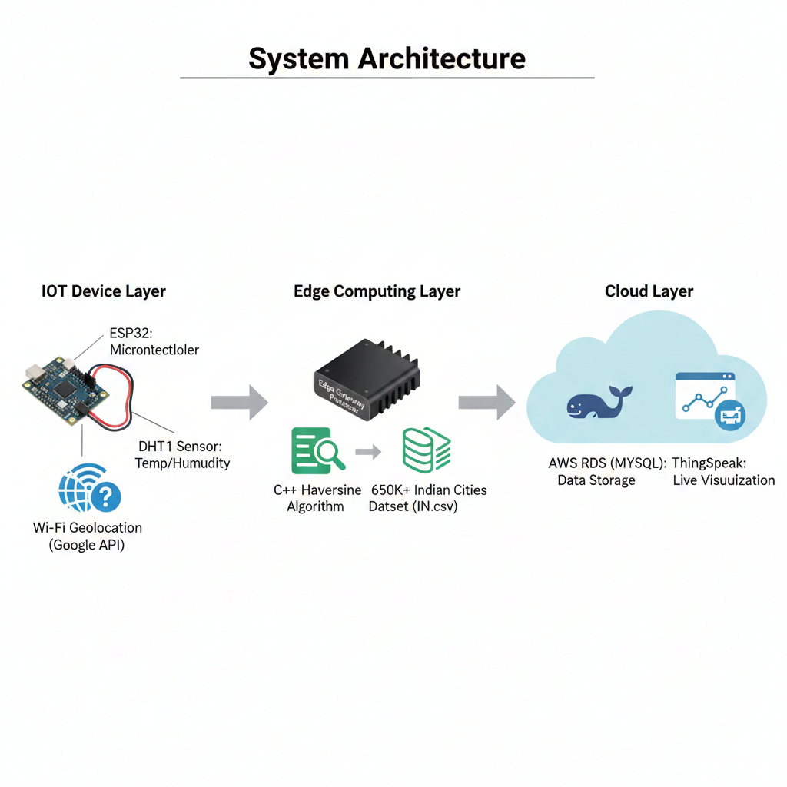

# IoT-Based Weather Monitoring System with Edge Geospatial Processing

## 📌 Overview
This project is a real-time **IoT Weather Monitoring System** that collects environmental data and determines its location **without a GPS module**. It uses an architecture of **IoT + Edge Computing + Cloud** to handle data efficiently.

The system was awarded **1st Prize** in an IoT & Edge Computing Hackathon for its innovative GPS-free geolocation and edge-based processing design.

## 🚀 Key Features
* 🌡️ **Environmental Sensing:** Real-time temperature and humidity tracking using the DHT11 sensor.
* 📡 **GPS-Free Geolocation:** Uses Wi-Fi triangulation via the **Google Geolocation API** to get coordinates.
* 🧠 **Edge Processing:** Offloads heavy geospatial calculations to an edge gateway to find the nearest city name using the **Haversine Algorithm**.
* 🗄️ **Cloud Integration:** Permanent data storage on **AWS RDS (MySQL)**.
* 📊 **Live Dashboard:** Real-time data visualization using **ThingSpeak**.

## 🏗️ System Architecture

1.  **Sensing Layer:** ESP8266/ESP32 collects DHT11 data and scans nearby Wi-Fi SSIDs.
2.  **Edge Layer:** A local processor receives coordinates, searches a dataset of **650,000+ Indian cities**, and identifies the specific location.
3.  **Cloud Layer:** The processed, location-tagged data is sent to AWS for storage and ThingSpeak for the UI.



## 🧩 Project Workflow

1.  **Data Collection:** The ESP8266/ESP32 reads temperature and humidity.
2.  **Geolocation:** Instead of a GPS module, the device sends nearby Wi-Fi MAC addresses to the Google Geolocation API to receive Latitude and Longitude.
3.  **Edge Computation:** Because the 650K+ city dataset (IN.csv) is too large for a microcontroller's memory, the coordinates are sent to an **Edge Gateway**.
4.  **Haversine Logic:** The Edge Gateway runs a C++ module to calculate the "Great-circle distance" and finds the closest city from the dataset.
5.  **Data Upload:** The final packet (Temp, Humidity, Lat, Lon, City Name) is uploaded to **AWS RDS** and **ThingSpeak**.

---

## 💻 Technologies Used

### **Hardware**
* **ESP8266 / ESP32** (Microcontroller with Wi-Fi)
* **DHT11** (Temperature & Humidity Sensor)

### **Software & Services**
* **C++ / Arduino IDE:** For firmware and edge logic.
* **Google Geolocation API:** For location services.
* **AWS RDS (MySQL):** For structured cloud storage.
* **ThingSpeak:** For IoT analytics and graphing.
* **Haversine Formula:** For calculating distances between two points on a sphere.

---

## 📂 Code Structure
```text
├── main.ino             # Main Arduino sketch for ESP8266/ESP32
├── geolocation.h        # Logic for Google API communication
├── nearest_city.cpp     # Edge module for city mapping (Haversine)
├── IN.csv               # Dataset of 650K+ Indian cities
└── README.md            # Project documentation
```

# ⚙️ Setup Instructions

## 1. Clone the Repository

```bash
git clone https://github.com/karthikeyan1134/IoT-Based-Weather-Monitoring-System.git
cd IoT-Based-Weather-Monitoring-System
```

## 2. Configure API Keys

Open the header files or the main sketch file in your editor and update the following variables:

* **Wi-Fi Credentials**: `SSID` and `Password`
* **Google Geolocation API Key**: Obtain from Google Cloud Console.
* **AWS RDS**: Endpoint URL, Username, and Password.
* **ThingSpeak**: Your specific Write API Key.

## 3. Hardware Connections

* **VCC**: Connect to 3.3V
* **GND**: Connect to Ground
* **Data Pin**: Connect to a GPIO pin (e.g., D2 or GPIO4)

## 4. Run the Edge Module

* Ensure the `IN.csv` file is placed in the same directory as your edge processor script.
* Start the edge module on your local machine or gateway to listen for incoming coordinates from the ESP device.

## 5. Upload Firmware

* Open the project in Arduino IDE.
* Go to **Tools > Board** and select your specific module (ESP8266 or ESP32).
* Select the correct **Port** and click **Upload**.

---

## 📊 Expected Output

* **Serial Monitor**: You will see real-time logs displaying Latitude/Longitude, Temperature/Humidity, and the identified Nearest City.
* **ThingSpeak**: Visual live charts showing environmental trends over time.
* **AWS RDS**: Your MySQL database will be populated with rows containing location-tagged weather records for long-term storage.

---

## 🏆 Achievement

🥇 **1st Prize Winner** at the IoT & Edge Computing Hackathon. This project was recognized for its unique ability to overcome the memory limitations of microcontrollers by offloading heavy geospatial calculations to the Edge, and for providing accurate location data without the need for expensive or indoor-limited GPS hardware.

---

## 👤 Author

**Karthikeyan K**

* University: SRM University-AP

